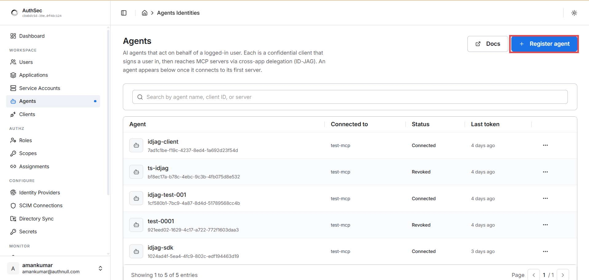
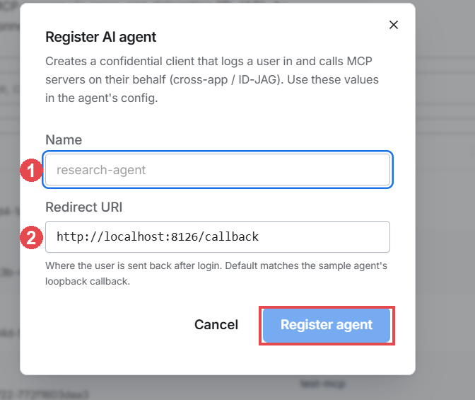
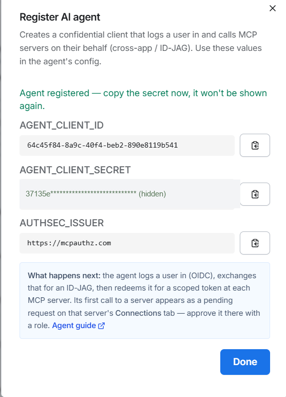
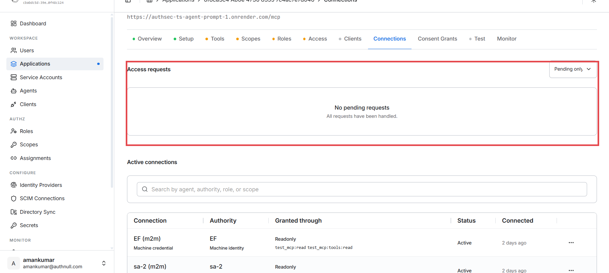

# Guide 3 — ID-JAG delegation: agents acting on behalf of a user

*Time: ~20 minutes. You'll register an AI agent, wire the SDK, log a user in
through the agent, approve it once in the dashboard — and end with an agent
that calls MCP tools with the **user's** permissions, fully auditable and
revocable.*

[← Guide 2: M2M auth](m2m-auth.md) | [Docs home](README.md)

---

## Why ID-JAG exists

An M2M service (guide 2) acts as **itself** — its own identity, its own
permissions. But a copilot or chatbot acts **for a person**: when Alice asks
her assistant to check her tickets, the MCP server should apply *Alice's*
permissions, not the agent's — and the audit log should say *"Alice, via
agent X"*.

The naive solutions are all bad:

| Approach | Problem |
|---|---|
| Give the agent a powerful service account | Every user gets the same (over-broad) access; audit says "the bot did it" |
| Hand the user's own token to the agent | The agent can do *everything* the user can, everywhere, invisibly |
| Screen-scrape / password sharing | Please no |

**ID-JAG** (Identity Assertion JWT Authorization Grant — the emerging
cross-app access standard, also called **XAA**) solves it properly: the user
logs in once, the agent exchanges *proof of that login* for a **scoped,
short-lived token** that carries both identities:

```json
{
  "sub": "alice@example.com",        ← whose authority
  "act": { "client_id": "agent-x" },  ← who is acting
  "scope": "test_mcp:read ...",       ← only what was requested & approved
  "aud": "https://your-mcp/mcp"       ← only this server
}
```

The user consents once, an admin approves once, and either can be revoked at
any time — killing the agent's access without touching the user's own.

## The flow

The SDK does all of this in one `access_for()` call:

```
   user                agent (your code)                AuthSec              MCP server
    │                        │                             │                     │
    │  1. browser_login()    │                             │                     │
    │◀───opens browser───────│                             │                     │
    │   logs in + consents   │                             │                     │
    │   to requested scopes  │                             │                     │
    │────────id_token───────▶│                             │                     │
    │                        │  2. token-exchange          │                     │
    │                        │     (id_token → ID-JAG)     │                     │
    │                        │────────────────────────────▶│                     │
    │                        │◀───────ID-JAG───────────────│                     │
    │                        │  3. jwt-bearer              │                     │
    │                        │     (ID-JAG → access token) │                     │
    │                        │────────────────────────────▶│                     │
    │                        │◀──scoped access token───────│                     │
    │                        │  4. tools/call with Bearer token────────────────▶ │
    │                        │◀──────────────────────result──────────────────────│
```

Step 1 happens once per user session; steps 2–3 are invisible; the token is
cached until near expiry.

---

## Step 1 — Register the agent in the dashboard

Open **Agents** in the sidebar. This page lists every AI agent in the
workspace with which server it's connected to, its status
(Connected/Revoked), and when it last got a token. Click **＋ Register
agent**:



> Note the page's own description: an agent is *"a confidential client that
> signs a user in, then reaches MCP servers via cross-app delegation
> (ID-JAG)"*. An agent appears in this list once it connects to its first
> server.

Fill in the two fields:



1. **Name** — a human label, e.g. `research-agent`
2. **Redirect URI** — where the user's browser lands after login. For the
   SDK's `browser_login()` keep the loopback default
   (`http://localhost:8126/callback`); for a web app, use your app's own
   OAuth callback URL.

## Step 2 — Copy the credentials (shown once!)

On success the dialog shows the agent's credentials — **copy the secret now,
it won't be shown again**:



Put them in your agent's `.env`:

```bash
AUTHSEC_ISSUER=https://mcpauthz.com
AGENT_CLIENT_ID=64c45f84-...
AGENT_CLIENT_SECRET=<the secret you copied>
MCP_URL=https://your-mcp-server.example.com/mcp
```

The dialog also tells you what happens next — the agent logs a user in
(OIDC), exchanges that for an ID-JAG, redeems it at each MCP server, and
its **first call appears as a pending request on the server's Connections
tab**. That's steps 4–5 below.

## Step 3 — Wire the SDK

```python
import asyncio, os
from dotenv import load_dotenv
from authsec_sdk import (
    AgentIdentity, browser_login,
    PendingApprovalError, ApprovalDeniedError, poll_until_approved,
)

load_dotenv()
ISSUER  = os.environ["AUTHSEC_ISSUER"]
CLIENT  = os.environ["AGENT_CLIENT_ID"]
SECRET  = os.environ["AGENT_CLIENT_SECRET"]
MCP_URL = os.environ["MCP_URL"]

async def main():
    # 1. Log the user in (opens the browser; prints the URL as fallback).
    #    Web apps: skip this and pass the id_token from your own OIDC login.
    id_token = await browser_login(
        issuer=ISSUER, client_id=CLIENT, resource=MCP_URL,
    )

    # 2. The agent's own identity. One instance per process — reuse it.
    agent = AgentIdentity(
        issuer=ISSUER, client_id=CLIENT, client_secret=SECRET,
        idp_issuer=ISSUER,
    )

    # 3. Scoped token, delegated from the user.
    async with agent:
        try:
            token = await agent.access_for(
                MCP_URL,
                user_session={"subject_token": id_token},
                requested_scopes=["test_mcp:read", "test_mcp:tools:read"],
            )
        except PendingApprovalError as e:
            print("Waiting for admin approval in the dashboard…")
            token = await poll_until_approved(
                agent, MCP_URL, e.status_url,
                user_session={"subject_token": id_token},
                requested_scopes=["test_mcp:read", "test_mcp:tools:read"],
            )
        except ApprovalDeniedError:
            raise SystemExit("Admin declined access.")

    print("token:", token[:25], "…")
    # → use as  Authorization: Bearer {token}  on MCP requests

asyncio.run(main())
```

> **Scopes must exist on the target server** — check its PRM document
> (`/.well-known/oauth-protected-resource/mcp`, `scopes_supported`).
> Requesting a scope the server doesn't define looks exactly like "waiting
> for approval forever". This is the #1 gotcha.

## Step 4 — First run: the user logs in and consents

Run your agent. The browser opens to the AuthSec login; the user signs in
and sees a **consent screen listing exactly the scopes the agent is
requesting**. The user clicks Allow — **once**. This is the user-side half
of the double opt-in: *the user* agrees the agent may act for them with
these scopes.

## Step 5 — First run: the admin approves the connection

Meanwhile the SDK raised `PendingApprovalError` and is polling — because the
server-side half hasn't happened yet: *the admin* of the MCP server must
admit this agent. Open the application's **Connections** tab:



- **Access requests** (boxed) — the agent's first call appears here as a
  pending request. Approve it and pick the **role** it gets (e.g.
  `Readonly`). Your polling agent picks the approval up automatically and
  completes with a token — no restart needed.
- **Active connections** — every approved agent/service connection, showing
  the authority it acts under, the role and scopes it was granted through,
  and when it last connected.

## Step 6 — Every run after: seamless

That's the whole ceremony — **both approvals are one-time**. From now on the
same user + agent + server combination goes straight through: login →
cached/renewed token → tools. No consent screen re-run, no pending request,
no admin involvement.

## Revoking an agent

Both sides can kill the delegation at any time:

- **Per server** — the application's Connections tab → ⋮ on the connection →
  revoke. The agent's next call fails with `ConnectionRevokedError`.
- **Per agent** — the Agents page → ⋮ → revoke. The agents list shows the
  status flip to `Revoked` (you can see two revoked agents in the screenshot
  in step 1).

The user's own access is untouched — you're revoking *the agent's right to
act for them*, not the user.

---

## Error handling reference

| Exception | Meaning | What to do |
|---|---|---|
| `PendingApprovalError` | First contact — admin approval pending | `poll_until_approved(...)` (shown above) |
| `ApprovalDeniedError` | Admin declined the request | Inform the user; don't retry |
| `ConnectionRevokedError` | A previously approved connection was revoked | Re-request access or inform |
| `TrustedIssuerMissingError` | The IdP isn't trusted by the AuthSec AS | Dashboard: configure the identity provider |
| `CredentialInvalidError` | Agent's client_id/secret wrong | Re-copy from registration (or re-register) |

## Troubleshooting

| Symptom | Cause | Fix |
|---|---|---|
| Stuck "waiting for approval" forever, nothing in Connections tab | Requested scopes don't exist on the target server | Use scopes from the server's PRM `scopes_supported` |
| Browser doesn't open on `browser_login()` | Headless/remote session | The SDK always prints the auth URL — open it manually |
| `redirect_uri mismatch` at login | Agent registered with a different redirect URI | Match the registration (default `http://localhost:8126/callback`) |
| Token works, then suddenly 401s | Connection revoked, or token expired mid-session | `agent.clear_cache(MCP_URL)` and retry once; if `ConnectionRevokedError`, re-request |
| Agent missing from the Agents page | It has never successfully connected | Normal — it appears after its first server connection |

---

[← Guide 2: M2M auth](m2m-auth.md) | [Docs home](README.md)
