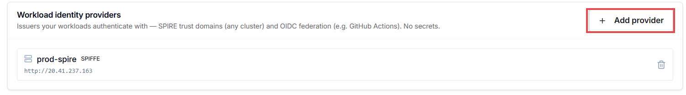
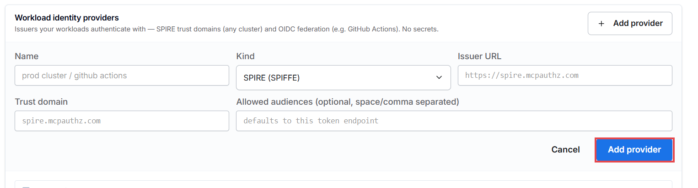
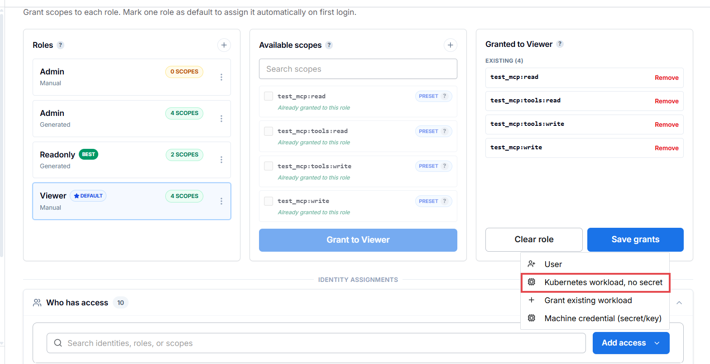
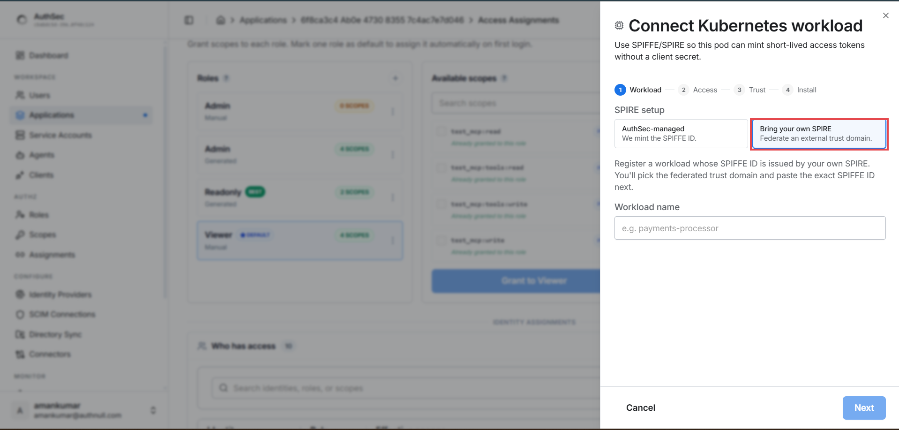
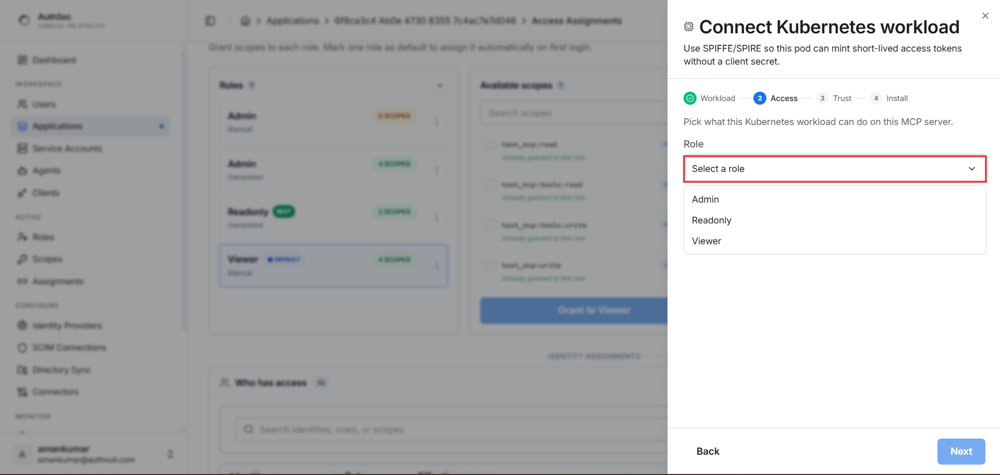
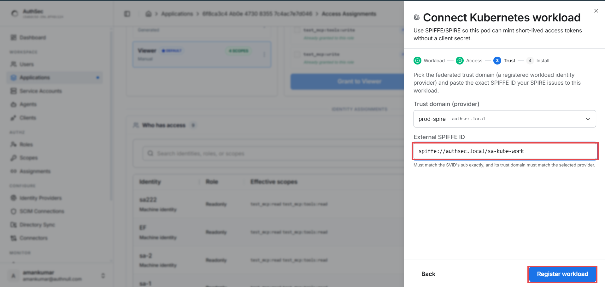
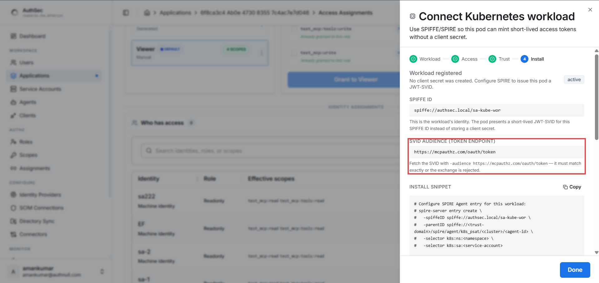

# Guide 2 — Machine-to-machine auth: three ways to prove who you are

*Time: ~15 minutes per method. You'll create a service account, pick a
credential type, grant it access to your MCP server, and acquire tokens from
code — no human in the loop.*

[← Guide 1: MCP protection](mcp-protection.md) | [Guide 3: ID-JAG →](idjag-delegation.md)

---

## When you need this

A data pipeline, a cron job, a backend service, a Kubernetes workload — any
program that calls a protected MCP server **as itself**, with its own
standing permissions, no user session. (If the caller acts *on behalf of a
logged-in user*, that's [guide 3](idjag-delegation.md).)

All three methods end at the same place — `POST /oauth/token`
(`client_credentials`) → scoped access token. They differ only in **how the
machine proves its identity**:

| Method | Proof | Secret on the wire? | Best for |
|---|---|---|---|
| **A. Client secret** | ID + shared secret (HTTP Basic) | ⚠️ every request | quick starts, simple deployments |
| **B. Private-key JWT** | RS256-signed assertion (RFC 7523) | ✅ never — key stays local | enterprise security postures |
| **C. SPIFFE SVID** | platform-attested workload identity | ✅ no stored credential at all | Kubernetes |

Security ladder: A → B → C goes from "shared password" to "asymmetric keys"
to "the infrastructure itself vouches for the workload".

In the SDK they're three interchangeable credential classes — same
`AgentIdentity`, same `access_for()`:

```python
from authsec_sdk import AgentIdentity, ClientSecretAuth, PrivateKeyJwtAuth, SpiffeSvidAuth

agent = AgentIdentity(ISSUER, CLIENT_ID, auth=ClientSecretAuth("sec_..."))          # A
agent = AgentIdentity(ISSUER, CLIENT_ID, auth=PrivateKeyJwtAuth("key.pem", kid="key-1"))  # B
agent = AgentIdentity(ISSUER, CLIENT_ID, auth=SpiffeSvidAuth(svid))                 # C

async with agent:
    token = await agent.access_for(MCP_URL, requested_scopes=["test_mcp:read"])
```

## Service accounts — the dashboard side

Machines are registered as **Service Accounts**. Open the page from the
sidebar — as its description says, each service account is a *machine
principal* holding one credential (client secret, private-key JWT, or
Kubernetes SPIFFE SVID) and is *"granted access to specific MCP servers
independently of any user session"*. Click **＋ Create service account**:


The filters show the credential split at a glance (Credential (M2M) /
Kubernetes / No credential), and the **Auth method** column shows what each
account holds.

> Methods **A and B** are created here (pick the auth method, then grant
> access). Method **C (SPIFFE)** takes a different path — as its option card
> says, it's *"configured per MCP server"*: you register a trust domain once
> under **Trusted Issuers**, then connect the workload from the app's
> **Access** tab. Full walkthrough in Method C below.

---

## Method A — Client secret

### A1. Create the service account

In the create dialog: name it, keep **Client secret** selected (the
default), and click **Create service account**:


### A2. Save the credentials — shown once


Copy both values into your service's `.env` — **the secret won't be shown
again** (the dialog also confirms the wire mechanics: `client_credentials`
grant with `client_secret_basic` auth — exactly what the SDK does for you):

```bash
AUTHSEC_ISSUER=https://mcpauthz.com
SA_CLIENT_ID=8a7c1107-...
SA_CLIENT_SECRET=<the secret you copied>     # 64 hex chars — copy, don't retype
MCP_URL=https://your-mcp-server.example.com/mcp
```

### A3. Grant access (both methods need this — see below), then code:

```python
import asyncio, os
from dotenv import load_dotenv
from authsec_sdk import AgentIdentity, ClientSecretAuth

load_dotenv()

async def main():
    agent = AgentIdentity(
        os.environ["AUTHSEC_ISSUER"],
        os.environ["SA_CLIENT_ID"],
        auth=ClientSecretAuth(os.environ["SA_CLIENT_SECRET"]),
    )
    async with agent:
        token = await agent.access_for(
            os.environ["MCP_URL"],
            requested_scopes=["test_mcp:read", "test_mcp:tools:read"],
        )
    print("token:", token[:25], "…")   # → Authorization: Bearer {token}

asyncio.run(main())
```

---

## Method B — Private-key JWT

No shared secret ever crosses the wire. Your service signs a short-lived
JWT assertion with its **private key**; AuthSec verifies the signature with
the **public key** you publish. Three preparation steps:

### B1. Generate a keypair

```bash
openssl genrsa -out private_key.pem 2048
openssl rsa -in private_key.pem -pubout -out public_key.pem
```

`private_key.pem` stays on the machine that runs your service. Never commit
it, never upload it anywhere.

### B2. Build and host the JWKS (the public key as JSON)

AuthSec fetches your public key from a URL, in JWKS format:

```json
{
  "keys": [
    {
      "kty": "RSA",
      "use": "sig",
      "alg": "RS256",
      "kid": "key-1",
      "n": "noFETcNJsPepUVEweAxoV1eb...   ← from your public key",
      "e": "AQAB"
    }
  ]
}
```

Generate it from `public_key.pem` with this one-time snippet:

```python
from cryptography.hazmat.primitives import serialization
import base64, json

pub = serialization.load_pem_public_key(open("public_key.pem", "rb").read())
n, e = pub.public_numbers().n, pub.public_numbers().e
b64u = lambda i, l: base64.urlsafe_b64encode(i.to_bytes(l, "big")).rstrip(b"=").decode()
print(json.dumps({"keys": [{
    "kty": "RSA", "use": "sig", "alg": "RS256", "kid": "key-1",
    "n": b64u(n, (n.bit_length() + 7) // 8), "e": b64u(e, 3),
}]}, indent=2))
```

Host the JSON anywhere public — your own domain
(`https://example.com/.well-known/jwks.json`), an S3 bucket, or a GitHub
gist for testing.

> ⚠️ **The JWKS URI must return raw JSON, not an HTML page.** With a gist,
> use the **raw** URL (`gist.githubusercontent.com/.../raw/.../jwks.json`) —
> the normal `gist.github.com/...` page URL serves HTML and verification
> fails with `parse JWKS: invalid character '<'`.

### B3. Create the service account with the JWKS URI

In the create dialog pick **Private-key JWT** — a **JWKS URI** field
appears; paste your URL:


This time there's no secret to save — just the `CLIENT_ID` (there's nothing
secret between you and AuthSec; your private key is the credential):


### B4. Grant access (below), then code:

```python
from authsec_sdk import AgentIdentity, PrivateKeyJwtAuth

agent = AgentIdentity(
    ISSUER, PK_CLIENT_ID,
    auth=PrivateKeyJwtAuth("private_key.pem", kid="key-1"),  # PEM path or PEM string
)
async with agent:
    token = await agent.access_for(MCP_URL, requested_scopes=["test_mcp:read"])
```

The `kid` must match the `kid` in your hosted JWKS. Each request signs a
fresh assertion — 5-minute lifetime, single-use `jti`, audience-bound to
the token endpoint — so an intercepted assertion is useless.

**Key rotation:** generate a new pair, add the new key to the JWKS under
`kid: "key-2"`, deploy the new private key with `kid="key-2"`, then remove
the old entry. No dashboard changes, no downtime.

---

## Method C — Kubernetes / SPIFFE

The strongest method: **no stored credential at all**. The SPIRE agent on
the node attests your pod and issues it a short-lived (~5 min) JWT-SVID;
AuthSec verifies it against your registered trust domain. Nothing to leak,
nothing to rotate.

```
your pod ──(unix socket)──▶ SPIRE agent ──▶ JWT-SVID (5 min)
   │                                            │
   └── SDK sends SVID as client assertion ──────┘
                    │
                    ▼
        AuthSec verifies against your trust domain's
        OIDC discovery (the "workload identity provider")
                    │
                    ▼
              scoped access token
```

Setup is three parts: your cluster (once), the trust registration (once),
and the workload connection (per app).

### C1. Cluster side — SPIRE (once per cluster)

You need a running SPIRE deployment with:

1. **SPIRE server + agents** (the standard [SPIRE quickstart](https://spiffe.io/docs/latest/try/getting-started-k8s/))
2. **A registration entry** mapping your pod's selectors to a SPIFFE ID:
   ```bash
   spire-server entry create \
     -spiffeID spiffe://your-trust-domain/your-workload \
     -parentID spiffe://your-trust-domain/spire-agent \
     -selector k8s:ns:default -selector k8s:sa:your-service-account
   ```
3. **The OIDC discovery endpoint exposed** (spire-oidc-discovery-provider) —
   a public URL where AuthSec can fetch your trust domain's keys. This URL
   becomes the **Issuer URL** in the next step.
4. **The agent socket mounted into your workload pod** — the SDK reads
   SVIDs from the SPIRE agent's unix socket, so your pod spec needs:
   ```yaml
   volumes:
     - name: spire-agent-socket
       hostPath: { path: /run/spire/sockets, type: Directory }
   containers:
     - name: your-app
       volumeMounts:
         - name: spire-agent-socket
           mountPath: /run/spire/sockets
           readOnly: true
   ```

> Setting up SPIRE itself (server, agents, node attestation) is standard
> SPIFFE infrastructure — follow the official quickstart above. This guide
> only covers the parts specific to AuthSec.

### C2. Register the trust domain (dashboard, once)

Sidebar → **Trusted Issuers** → **Workload identity providers**. As the
page says: *"Issuers your workloads authenticate with — SPIRE trust domains
(any cluster) and OIDC federation (e.g. GitHub Actions). No secrets."*
Click **＋ Add provider**:



Fill the form:



- **Name** — a label, e.g. `prod-spire`
- **Kind** — `SPIRE (SPIFFE)`
- **Issuer URL** — your SPIRE OIDC discovery URL from C1.3
- **Trust domain** — your SPIFFE trust domain (e.g. `authsec.local`)
- **Allowed audiences** — leave empty: *defaults to this token endpoint*,
  which is exactly what SVIDs must be minted for

### C3. Connect the workload to your MCP app (per app)

Open your application → **Access** tab → **Add access** → pick
**Kubernetes workload, no secret**:



A four-step wizard opens ("Use SPIFFE/SPIRE so this pod can mint
short-lived access tokens without a client secret"):

**Step 1 — Workload.** Choose your SPIRE setup — **AuthSec-managed** (they
mint the SPIFFE ID for you) or **Bring your own SPIRE** (federate the trust
domain you registered in C2) — and name the workload:



**Step 2 — Access.** Pick the role this workload gets on the MCP server
(the roles from guide 1):



**Step 3 — Trust.** Select your registered provider (e.g.
`prod-spire · authsec.local`) and paste the **exact SPIFFE ID** from your
registration entry (format: `spiffe://your-trust-domain/ns/prod/sa/api`).
As the form warns: it *must match the SVID's `sub` exactly, and its trust
domain must match the selected provider*. Click **Register workload**:



**Step 4 — Install.** Confirmation: *"Workload registered — no client
secret was created. Configure SPIRE to issue this pod a JWT-SVID."* Read
this screen closely:



- **SPIFFE ID** — the workload's identity; the pod presents a short-lived
  JWT-SVID for this ID instead of storing any secret
- **SVID AUDIENCE (TOKEN ENDPOINT)** — the dashboard states the rule
  explicitly: *"Fetch the SVID with `-audience
  https://mcpauthz.com/oauth/token` — it must match exactly or the exchange
  is rejected."*
- **INSTALL SNIPPET** — a ready-made `spire-server entry create` command
  for your cluster (fill in your namespace/service-account selectors)

Click **Done** — the workload appears in the app's **Who has access** list
as an active Machine identity with its role and effective scopes.

### C4. Code

Inside the pod, the SDK fetches and renews SVIDs automatically:

```python
from authsec_sdk import SpiffeWorkloadIdentity, SpiffeConfig

spiffe = SpiffeWorkloadIdentity(SpiffeConfig(
    mcp_server_url="https://your-mcp-server.example.com/mcp",
    client_id="YOUR_SPIFFE_CLIENT_ID",           # from step 4 (Install)
    spiffe_id="spiffe://your-domain/your-workload",
    scopes=["test_mcp:read"],
    # agent_socket_path="/run/spire/sockets/agent.sock",
))
async with spiffe:
    token = await spiffe.access_for()
```

Already hold an SVID (e.g. minted manually for testing outside a pod)? Use
the low-level class — but mind two hard-won rules:

```python
agent = AgentIdentity(ISSUER, SPIFFE_CLIENT_ID, auth=SpiffeSvidAuth(svid))
```

- **The SVID's audience must be the token endpoint**
  (`https://mcpauthz.com/oauth/token`) — an SVID minted with just the issuer
  as audience is rejected with *"token aud must include this token endpoint"*.
  (This is why C2's "Allowed audiences" default is right.)
- **SVIDs live ~5 minutes** — mint immediately before use;
  `SpiffeSvidAuth` does not refresh (use `SpiffeWorkloadIdentity` for that).

---

## Grant access — required for every method

Creating a service account gives it an identity, **not permissions**. The
credentials dialog says it directly: *"Grant this service account access to
an MCP server from its Access Assignments tab."* Until you do, every token
request fails with:

```
access_denied: client not authorized for this resource server
```

Assign a role (e.g. `Readonly` with the read scopes) to the service account
for your target application — the same roles you built in
[guide 1, step 7](mcp-protection.md#step-7--fix-the-default-access-policy-access-tab).
Once granted, the connection appears on the application's **Connections**
tab as an active `(m2m)` connection showing the role and scopes it was
granted through.

## Verify

Run the code from any method — then prove the token works:

```python
import httpx, json

async def tools_list(token: str):
    async with httpx.AsyncClient(timeout=30) as c:
        r = await c.post(MCP_URL,
            json={"jsonrpc": "2.0", "method": "tools/list", "id": 1},
            headers={"Authorization": f"Bearer {token}",
                     "Accept": "application/json, text/event-stream"})
        return r
```

You should see only the tools your granted scopes allow. The application's
**M2M Logs** (sidebar, under Monitor) shows every token grant as it happens.

## Troubleshooting

Every row here is an error we hit for real while building this SDK:

| Error | Cause | Fix |
|---|---|---|
| `invalid_client: invalid client secret` | Typo'd/rotated secret (they're 64 hex chars) | Copy-paste from the dashboard, never retype |
| `access_denied: client not authorized for this resource server` | Credential is **valid** but no access assignment exists | Grant a role for the target application (section above) |
| `JWKS resolution failed: parse JWKS: invalid character '<'` | JWKS URI returns HTML (gist page URL, 404 page, …) | Point it at raw JSON; for gists use the `raw` URL |
| `invalid_client: token aud must include this token endpoint` | SPIFFE SVID minted with wrong audience | Mint with `audience = <issuer>/oauth/token` |
| `invalid_client: … token is expired` | JWT-SVIDs live ~5 min | Mint right before use, or use `SpiffeWorkloadIdentity` |
| Signature verification fails (private-key JWT) | `kid` mismatch between code and JWKS, or wrong key | Make `PrivateKeyJwtAuth(kid=...)` match the JWKS `kid` |

---

[← Guide 1: MCP protection](mcp-protection.md) | [Guide 3: ID-JAG →](idjag-delegation.md)
