# Guide 1 — Protect your MCP server

*Time: ~15 minutes. You'll go from an unprotected MCP server to one where
every tool call requires a valid OAuth token with the right scopes — and
admins control access from the AuthSec dashboard without touching your code.*

[← Docs home](README.md) | [Guide 2: M2M auth →](m2m-auth.md)

---

## What you'll have at the end

```
BEFORE                                AFTER
──────                                ─────
POST /mcp tools/call  ──▶ runs 😱     POST /mcp (no token)      ──▶ 401 + how-to-auth
                                      POST /mcp (bad token)     ──▶ 401
anyone on the network                 POST /mcp (missing scope) ──▶ 403 for that tool
can call every tool                   POST /mcp (valid + scoped)──▶ tool runs ✅

                                      + your tools listed in the dashboard
                                      + admins assign per-tool permissions there
                                      + policy changes live in ~30s, no redeploy
```

## How it works

The SDK wraps your MCP endpoint. Nothing reaches your tool code until three
gates pass:

```
        agent request: POST /mcp  (Authorization: Bearer eyJ...)
                              │
            ┌─────────────────▼──────────────────┐
            │  authsec-sdk (mount_mcp)            │
            │                                     │
            │  GATE 1  token valid?               │──✘──▶ 401 + WWW-Authenticate
            │          (JWT signature + live      │       (tells the agent where
            │           introspection)            │        to get a token)
            │                                     │
            │  GATE 2  which tool is being        │
            │          called? (parses tools/call)│
            │                                     │
            │  GATE 3  do the token's scopes      │──✘──▶ 403 insufficient_scope
            │          cover that tool?           │
            │          (live policy from the      │
            │           dashboard, 30s cache)     │
            └─────────────────┬──────────────────┘
                              │ all pass
                              ▼
                      your tool code runs
```

Two things happen automatically at startup:

- **PRM publishing** — your server self-describes at
  `/.well-known/oauth-protected-resource/mcp` (RFC 9728) so agents can
  discover where to get tokens. You never write this endpoint.
- **Manifest publishing** — the SDK enumerates your tools and registers them
  with the dashboard, so admins see `add_no`, `multiply_no`, … by name and
  assign scopes to each.

---

## Prerequisites

- An AuthSec workspace on [https://mcpauthz.com](https://mcpauthz.com)
- Python ≥ 3.10 and `pip install authsec-sdk fastapi uvicorn python-dotenv mcp`
- A **public URL** for your server — agents and AuthSec must be able to reach
  it. For local development use an [ngrok](https://ngrok.com) tunnel:
  `ngrok http 8000` → gives you `https://xxxx.ngrok-free.app`.

---

## Step 1 — Sign in to the dashboard

Go to [https://mcpauthz.com](https://mcpauthz.com) and sign in (or create a
workspace) with your work email:

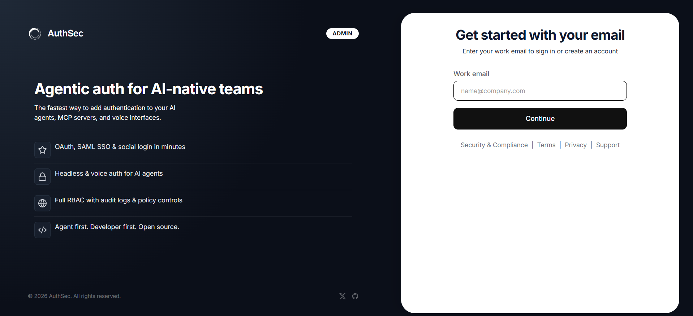

You land on the workspace dashboard. The tiles up top show your protected
applications at a glance; the quick-start cards below track your setup
progress — **"Wrap your first MCP server"** is the one this guide completes:

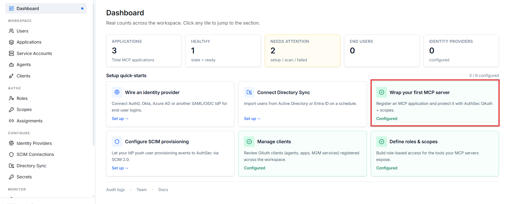

> **Dashboard vocabulary:** AuthSec calls a protected MCP server an
> **Application**. In OAuth terms it's a *resource server* — same thing,
> friendlier name. The left sidebar groups everything you'll meet in these
> guides: **Applications** (your MCP servers), **Service Accounts** and
> **Agents** (things that call them — guides 2 and 3), **Roles / Scopes /
> Assignments** (who may call what).

## Step 2 — Create the application

Open **Applications** in the sidebar. This page lists every protected MCP
server in your workspace with its readiness and risk state. Click
**＋ Create application**:

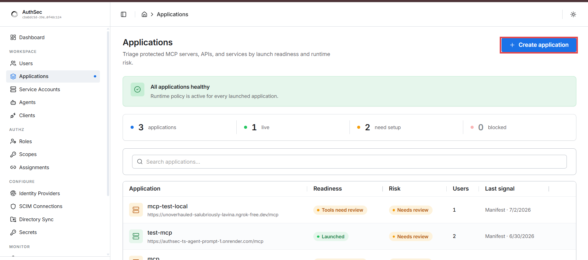

### 2a. Define the protected endpoint

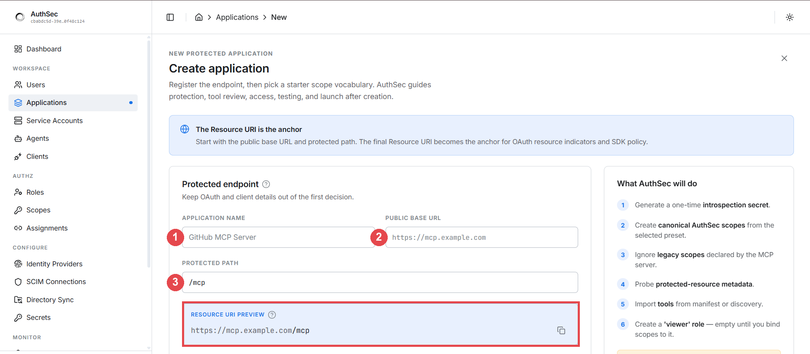

Three fields:

- **Application name** — a human label, e.g. `my-mcp-server`
- **Public base URL** — where your server is reachable,
  e.g. `https://xxxx.ngrok-free.app`
- **Protected path** — the MCP endpoint path, typically `/mcp`

The **Resource URI preview** shows the combination
(`https://xxxx.ngrok-free.app/mcp`). This URI is the anchor for everything —
it must **exactly** match the URL agents will call (scheme, host, path),
because tokens are bound to it (RFC 8707 resource indicators).

Note the **"What AuthSec will do"** panel on the right — when you submit,
the dashboard automatically: generates a one-time introspection secret,
creates canonical scopes from your chosen preset, probes your
protected-resource metadata, imports your tools from the manifest, and
creates an empty `viewer` role to hang scopes on. You'll meet each of these
artifacts below.

### 2b. Pick the access vocabulary (scope preset)

Scroll down to **Access vocabulary** — this generates the scope strings your
server will use. Presets range from read-only to domain-specific shapes
(database, RAG, code & repos):

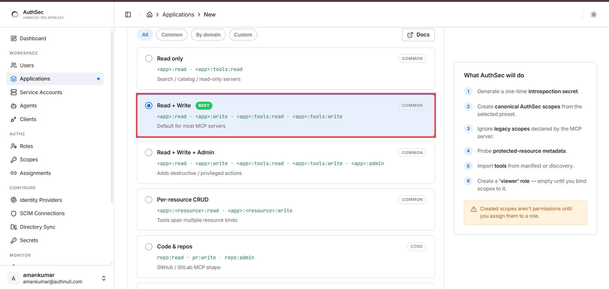

For most MCP servers pick **Read + Write** (marked BEST). With an app
namespace of `my_mcp` it generates four scopes:

```
my_mcp:read   my_mcp:write   my_mcp:tools:read   my_mcp:tools:write
```

> ⚠️ Note the warning in the sidebar: **"Created scopes aren't permissions
> until you assign them to a role."** Creating the vocabulary defines the
> *words*; steps 7–8 make them mean something.

Click **Create and protect**:

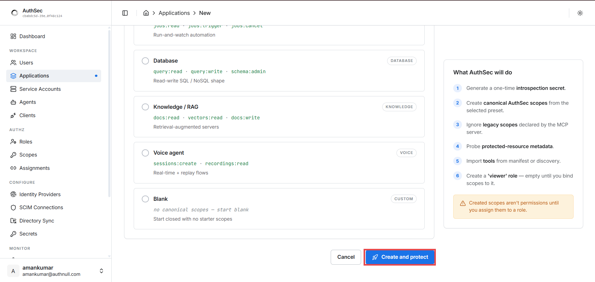

### 2c. Grab your credentials from the Setup tab

You land on the application's detail page. The tabs across the top —
**Overview · Setup · Tools · Scopes · Roles · Access · Clients · Test ·
Monitor** — are mission control for this server. Open **Setup**:

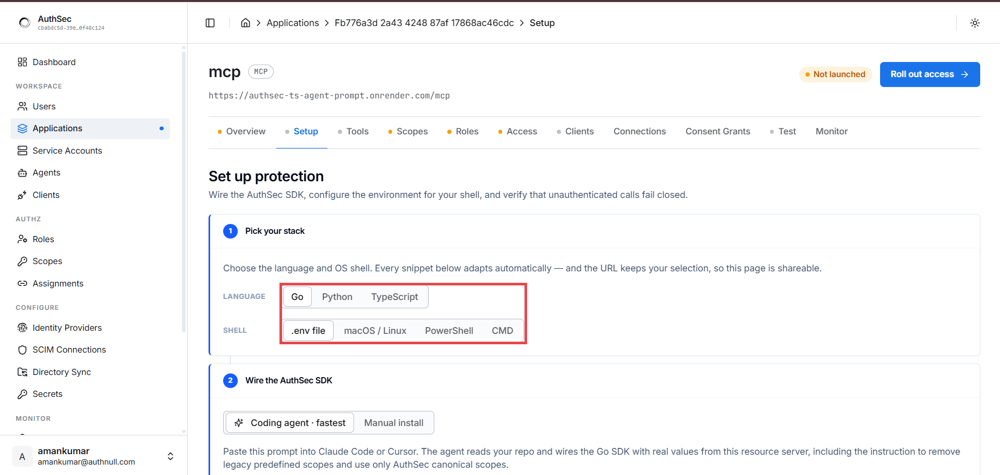

Pick your stack (**Python**, and **.env file** as the shell format) — the
page renders copy-paste-ready environment values for this exact
application, including the introspection credentials:

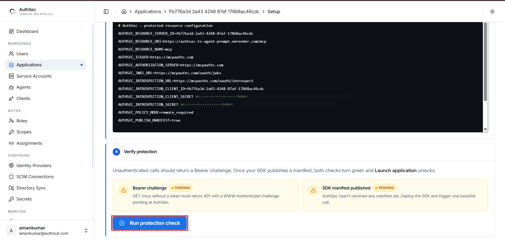

> 🔑 The **introspection secret is shown once** at creation. Copy it now. If
> you lose it, rotate it from this page. (Secrets are blurred in the image
> above — never commit yours to a repo either.)

Below the config block, note the **Verify protection** panel: two checks —
**Bearer challenge** (unauthenticated calls return 401) and **SDK manifest
published** — both `PENDING` until your server is running. You'll come back
and hit **Run protection check** in step 6; when both turn green, **Launch
application** unlocks. Until then the application shows **Not launched** —
expected.

## Step 3 — Configure the environment

Paste the values from the Setup tab into a `.env` next to your server:

```bash
# Who issues tokens
AUTHSEC_ISSUER=https://mcpauthz.com
AUTHSEC_AUTHORIZATION_SERVER=https://mcpauthz.com
AUTHSEC_JWKS_URL=https://mcpauthz.com/oauth/jwks
AUTHSEC_INTROSPECTION_URL=https://mcpauthz.com/oauth/introspect

# From the Setup tab (unique per application)
AUTHSEC_RESOURCE_SERVER_ID=<resource-server-uuid>
AUTHSEC_INTROSPECTION_CLIENT_ID=<introspection-client-uuid>
AUTHSEC_INTROSPECTION_CLIENT_SECRET=<sec_...>

# Your server's identity — must match the Resource URI from step 2a
AUTHSEC_RESOURCE_URI=https://xxxx.ngrok-free.app/mcp
AUTHSEC_RESOURCE_NAME=my-mcp-server

# Recommended production posture
AUTHSEC_POLICY_MODE=remote_required          # fail CLOSED if policy unavailable
AUTHSEC_VALIDATION_MODE=jwt_and_introspect   # signature check + live revocation check
AUTHSEC_PUBLISH_MANIFEST=true                # keep tool inventory synced to the dashboard
```

> **Why `remote_required`?** If your server can't fetch the tool→scope policy
> from AuthSec, it **denies all tool calls** rather than guessing. The
> alternative (fail open) means a network hiccup silently disables your
> security. Fail closed is the production default for a reason.

> **Why `jwt_and_introspect`?** JWT signature alone can't detect a token that
> was **revoked** five minutes ago. Introspection asks AuthSec live. Belt and
> suspenders.

## Step 4 — Write the server

This is a complete, runnable server — two tools, fully protected:

```python
# server.py
import os
from fastapi import FastAPI
from mcp.server.fastmcp import FastMCP
from authsec_sdk import from_env, mount_mcp, ManifestTool
from dotenv import load_dotenv

mcp = FastMCP("my-server")

@mcp.tool()
def add_no(a: float, b: float) -> float:
    return a + b

@mcp.tool()
def multiply_no(a: float, b: float) -> float:
    return a * b

def my_tools():
    return [
        ManifestTool(
            name="add_no",
            description="Add two numbers",
            input_schema={
                "type": "object",
                "properties": {"a": {"type": "number"}, "b": {"type": "number"}},
                "required": ["a", "b"],
            },
        ),
        ManifestTool(
            name="multiply_no",
            description="Multiply two numbers",
            input_schema={
                "type": "object",
                "properties": {"a": {"type": "number"}, "b": {"type": "number"}},
                "required": ["a", "b"],
            },
        ),
    ]

load_dotenv()
cfg = from_env()                       # reads all AUTHSEC_* vars from step 3
cfg.tool_inventory_provider = my_tools # explicit manifest for the dashboard

app = FastAPI()
mount_mcp(app, "/mcp", mcp, cfg)       # ← the entire integration is this line
```

Notice what you did **not** write: no token parsing, no JWKS fetching, no
scope checks, no metadata endpoint, no per-tool guards. The tools are plain
functions.

> **`tool_inventory_provider` is optional.** If you omit it, the SDK
> enumerates your tools automatically at startup by performing a synthetic
> MCP handshake against your own handler, so the schemas come straight from
> your `@mcp.tool()` type hints. Set it explicitly (as above) when you want
> a deterministic, hand-curated manifest — it's also what we use in our own
> E2E tests.

`mount_mcp(app, path, handler, cfg)` accepts three handler forms:

1. A **FastMCP instance** (shown above) — auto-detected and wrapped
2. A plain **async request handler** — `async def handler(request) -> Response`
   if you hand-rolled your MCP route
3. Any **ASGI app** — `mount_mcp(app, "/mcp", wrap_asgi_handler(asgi_app), cfg)`

## Step 5 — Run and verify the protection

```bash
uvicorn server:app --host 0.0.0.0 --port 8000
# in another terminal, if local:
ngrok http 8000
```

**Check 1 — the PRM document is served** (agents discover your server through this):

```bash
curl https://xxxx.ngrok-free.app/.well-known/oauth-protected-resource/mcp
```

```json
{
  "resource": "https://xxxx.ngrok-free.app/mcp",
  "authorization_servers": ["https://mcpauthz.com"],
  "scopes_supported": ["my_mcp:read", "my_mcp:tools:read", "..."]
}
```

**Check 2 — unauthenticated calls are rejected:**

```bash
curl -i -X POST https://xxxx.ngrok-free.app/mcp \
  -H "Content-Type: application/json" \
  -d '{"jsonrpc":"2.0","method":"tools/list","id":1}'
```

```
HTTP/1.1 401 Unauthorized
WWW-Authenticate: Bearer resource_metadata=
  "https://xxxx.ngrok-free.app/.well-known/oauth-protected-resource/mcp"
```

The 401 isn't a dead end — the `WWW-Authenticate` header tells a
well-behaved agent exactly where to go to authenticate. This is the MCP
authorization spec working as designed.

**Check 3 — your tools appeared in the dashboard.** Because
`AUTHSEC_PUBLISH_MANIFEST=true`, the SDK published your tool inventory at
startup. Open the application's **Tools** tab — every tool is listed with
its runtime access state (`role-gated`), an auto-assessed **risk level**,
and the **access label** (scope) that gates it:

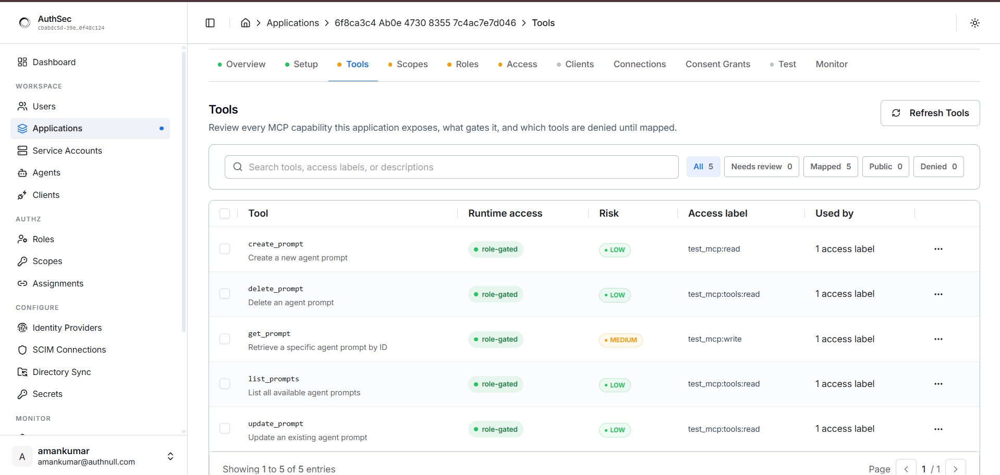

Use the filters (**Needs review / Mapped / Public / Denied**) to spot tools
that aren't gated yet — unmapped tools stay denied. **Refresh Tools**
re-imports after you add new `@mcp.tool()` functions and reboot.

## Step 6 — Run the protection check

With the server running, go back to the **Setup** tab and click
**Run protection check**. The dashboard probes your live server end-to-end
and reports a full validation checklist:

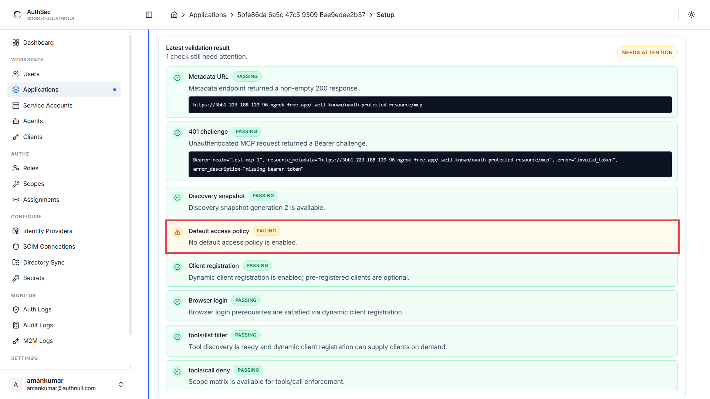

What each check proves:

| Check | What the dashboard verified |
|---|---|
| **Metadata URL** | Your PRM endpoint returns a non-empty 200 |
| **401 challenge** | Unauthenticated MCP requests get a proper Bearer challenge |
| **Discovery snapshot** | Your server's discovery data was captured |
| **Default access policy** | A default role exists so callers get access on first login |
| **Client registration** | Agents have a way to register (pre-registered / DCR / CIMD) |
| **Browser login** | User-login prerequisites are satisfied |
| **tools/list filter** | Tool discovery is ready for scope-filtered listings |
| **tools/call deny** | The scope matrix is available for per-tool enforcement |

On a fresh application, **one check fails — `Default access policy`**
("No default access policy is enabled"). Everything the SDK serves is green;
what's missing is a dashboard-side decision: *what does a brand-new caller
get?* You fix that manually in the next step — it's the only check the
dashboard can't pass for you.

## Step 7 — Fix the default access policy (Access tab)

Open the **Access** tab. The banner spells out the problem — **"Default
access: closed. New users authenticate but receive no role on first
login."** Fix it in three clicks:

**1. Make a role the default** — open the role's **⋮ menu** → **Make
default role** (Viewer is the natural choice):

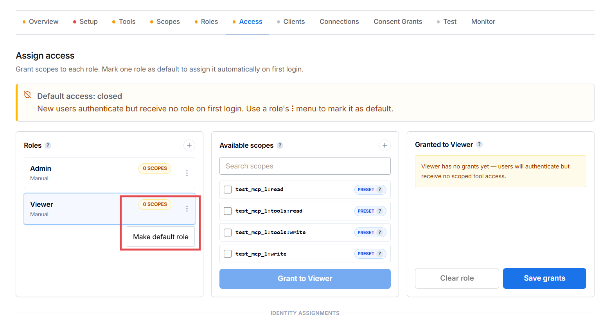

**2. Grant scopes to that role** — Viewer now shows the **DEFAULT** badge,
but as the hint says: *"Viewer is the default but grants nothing until you
assign at least one scope to it."* Tick the scopes it should carry and click
**Grant to Viewer**:

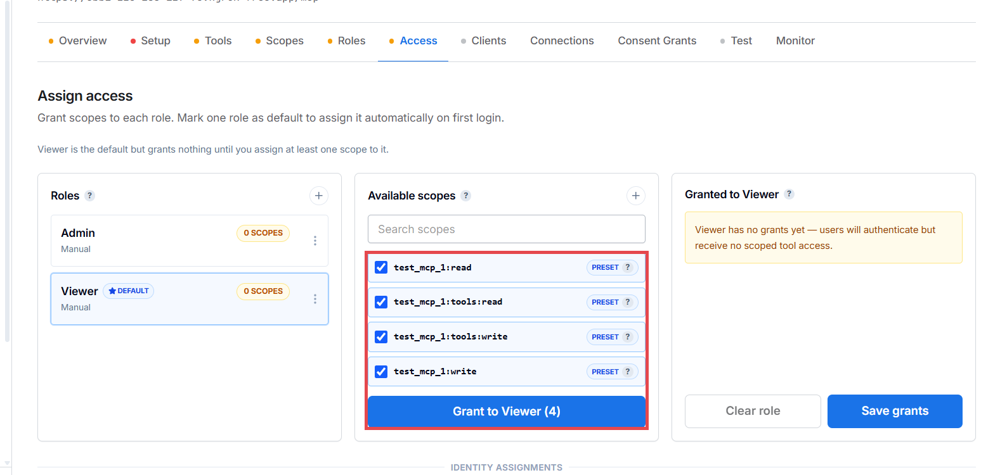

**3. Save grants** — the right panel shows the queued scopes
(`QUEUED · UNSAVED`); nothing is live until you click **Save grants**:

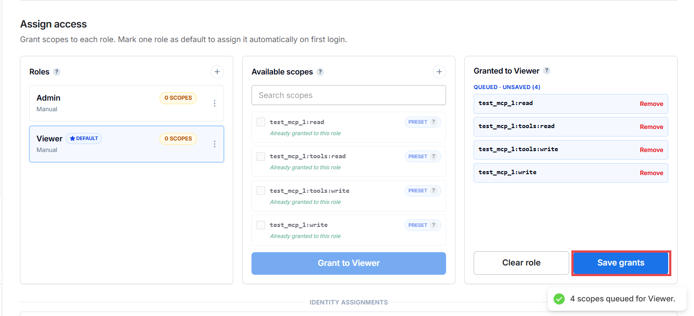

Now re-run the protection check on the **Setup** tab — **all checks pass**
and launch is unlocked:

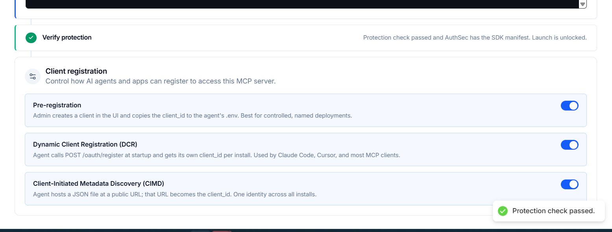

> **Also on this page — Client registration.** Three toggles control *how*
> agents may register to call this server: **Pre-registration** (admin
> creates the client in the UI, copies the `client_id` into the agent's
> `.env` — what guides 2 and 3 use), **DCR** (agents self-register via
> `POST /oauth/register` — how Claude Code and Cursor connect), and **CIMD**
> (the agent's identity is a JSON file it hosts at a public URL). Leave all
> three on unless you want to restrict registration styles.

## Step 8 — Map tools to access labels (Tools tab)

Open the **Tools** tab. Freshly imported tools show **`denied`** runtime
access and *"No label assigned"* — the fail-closed default:

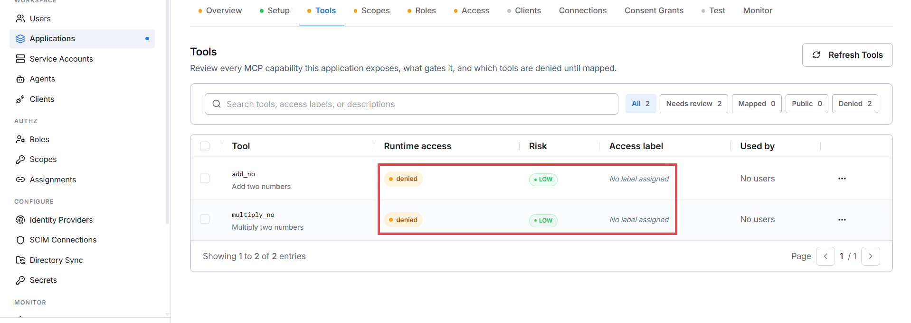

Click a tool to open its detail panel. It says exactly what's wrong —
**"Denied until mapped: the SDK will fail closed for this tool until an
operator maps it to an access label"** — and shows the three-step access
path (tool discovered → label mapping → user role grants label). Click
**Map** on the right access label:

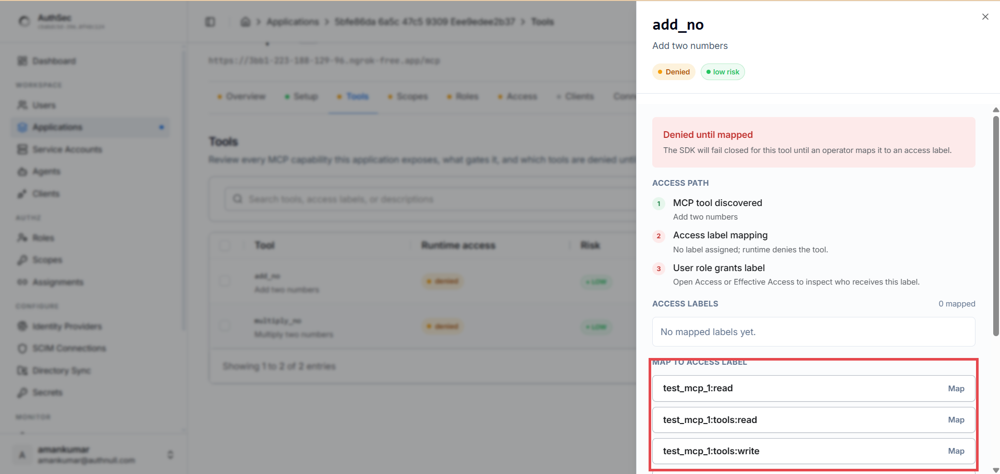

Map every tool you want callable, e.g.:

| Tool | Access label |
|---|---|
| `add_no` | `test_mcp_1:tools:read` |
| `multiply_no` | `test_mcp_1:tools:write` |

Anything left unmapped simply stays denied — safe by default.

## Step 9 — Launch 🚀

Go to the **Overview** tab. Runtime state reads **Ready**, tool exposure
shows your mapped count, and the **Launch application** button is active:

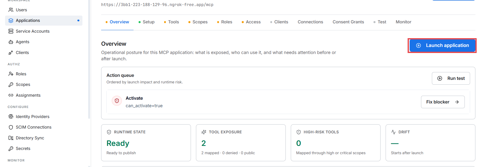

Click **Launch application**. The status chip flips to `Launched` — your
MCP server is now live and protected.

Who *gets* the roles you configured — service accounts, agents, users — is
the subject of guides [2](m2m-auth.md) and [3](idjag-delegation.md).

Your running server picks up policy changes within **~30 seconds** (it
polls the scope matrix with a 30s cache) — no restart, no redeploy.

## Step 10 — Full-circle test

Use the **Run test** button on the Overview tab (or the **Test** tab), or
curl with a real agent token (from guide [2](m2m-auth.md) or
[3](idjag-delegation.md)):

```bash
curl -X POST https://xxxx.ngrok-free.app/mcp \
  -H "Authorization: Bearer $TOKEN" \
  -H "Content-Type: application/json" \
  -H "Accept: application/json, text/event-stream" \
  -d '{"jsonrpc":"2.0","method":"tools/call","id":2,
       "params":{"name":"add_no","arguments":{"a":2,"b":3}}}'
```

- Token has `my_mcp:tools:read` → `add_no` runs, returns `5` ✅
- Same token calls `multiply_no` (needs `:write`) → `403 insufficient_scope` ✅
- `tools/list` responses are also **filtered** — callers only see the tools
  their scopes allow.

The **Monitor** tab shows the requests as they land — token subject, tool,
allow/deny decision.

---

## Behind the scenes (optional reading)

**Token validation** ([runtime/validator.py](../src/authsec_sdk/runtime/validator.py)) —
in `jwt_and_introspect` mode each request's token is (1) signature-verified
against AuthSec's JWKS, checking `iss`, `aud`, `exp`, and (2) introspected
live so revoked tokens die immediately. Verification runs in a worker thread
— your event loop never blocks.

**Scope matrix** ([runtime/scope_matrix.py](../src/authsec_sdk/runtime/scope_matrix.py)) —
the tool→scope mapping from step 8 is fetched from AuthSec and cached for
30s. That's the "propagates in ~30 seconds" guarantee.

**Manifest** ([runtime/manifest.py](../src/authsec_sdk/runtime/manifest.py)) —
at startup the SDK performs a synthetic MCP handshake against your own
handler (`initialize` → `tools/list`) and PUTs the result to AuthSec. Your
`@mcp.tool()` type hints are the single source of truth for schemas. Want a
hand-curated manifest instead? Set `cfg.tool_inventory_provider = my_tools`
returning a list of `ManifestTool`.

**PRM** ([runtime/metadata.py](../src/authsec_sdk/runtime/metadata.py)) —
the RFC 9728 document from check 1, with `scopes_supported` synced live from
the dashboard.

---

## Troubleshooting

| Symptom | Cause | Fix |
|---|---|---|
| Every tool call returns 403, policy state `needs_setup` | Vocabulary exists but tools aren't mapped / no default access | Steps 7–9 — default role + grants, map tools, launch |
| Protection check: `Default access policy` FAILING | No role is marked as default | Step 7 — role ⋮ menu → Make default role, grant scopes, Save grants |
| A tool stays `denied` after launch | "No label assigned" — unmapped tools fail closed | Step 8 — open the tool, Map an access label |
| `401` even with a fresh token | `AUTHSEC_RESOURCE_URI` doesn't exactly match the URL agents call (scheme/host/path) | Make them identical; re-check after ngrok URL changes |
| Tools don't appear in the Tools tab | `AUTHSEC_PUBLISH_MANIFEST` not `true`, or the startup manifest PUT failed | Check server logs at boot; verify introspection credentials |
| Scope changes not taking effect | Within the 30s cache window | Wait 30s; if still stale, check the server can reach `mcpauthz.com` |
| Everything breaks when AuthSec is briefly unreachable | `remote_required` failing closed — by design | For dev only, relax `AUTHSEC_POLICY_MODE`; keep fail-closed in production |
| ngrok URL changed after restart | Free ngrok URLs rotate | Update `AUTHSEC_RESOURCE_URI`, the application's base URL in the dashboard, and restart |
| Lost the introspection secret | It's shown once at creation | Rotate it from the application's Setup tab |

---

[← Docs home](README.md) | [Guide 2: M2M auth →](m2m-auth.md)
